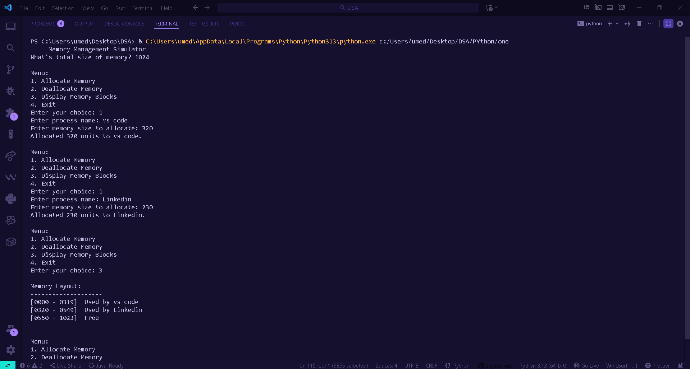

Memory Management Simulator (Linked List Project)

A Python-based simulator that demonstrates how operating systems manage memory dynamically using linked lists.

Features
- Dynamic allocation and deallocation of memory
- Merging of adjacent free blocks
- Handles invalid input and memory overflow
- Interactive console-based interface

Data Structure Used
Each memory block is represented as a **Linked List Node** containing:
- Start address  
- Block size  
- Process name  
- Status (Free / Allocated)

Technologies
- Python 3
- Data Structures & Algorithms (Linked List)

How to Run
```bash
python memory_simulator.py

Output Example


